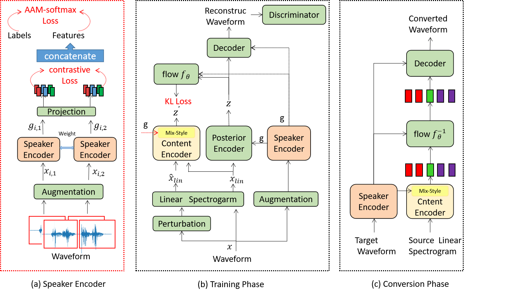

# FLOW-VAE VC2: RETHINKING CONDITIONAL METHODS FOR FLOW-VAE VC

Rongxiu Zhong, Shilei Zhang, Yanan Chen,Yong Ma, Huibao Yang, Junlan Feng 

## Abstract

Voice conversion (VC) seeks to modify one speaker’s voice to generate speech as if it came from another speaker. Our previous work Flow-VAE VC is an end-to-end system, but it still needs pre-trained model to extract the speaker embedding as conditional input and has an insurmountable gap between real and converted speech. To overcome these
limitations, we propose Flow-VAE VC2, it incorporates Mix-Style Layer Normalization (MSLN) to better disentangle content and speaker information, resulting in content representations with less speaker interference and more accurate linguistic features. To achieve speaker disentanglement directly from raw audio, we use the RawNet3 network as the speaker encoder, combined with supervised contrastive learning and AAM-softmax loss, optimizing the speaker embedding space by leveraging label information from the training data. Experimental results show that Flow-VAE VC2 outperforms SOTA VC models in terms of both naturalness and speaker similarity

    

The architecture of Flow-VAE VC2. (a) Latent variables g from the speaker encoder. (b) Overview training procedure. (c) Voice conversion from the
source speaker utterance to target speaker timbre in the inference stage.

## Audio Demos

This page contains voice conversion samples for FLOW-VAE VC2 applied to audio files from the [VCTK Corpus](https://datashare.ed.ac.uk/handle/10283/3443).
We provide comparisons with other models: FLOW-VAE VC

coming soooooon
<!-- Source: M1 -->

    

        <table class="table table-responsive align-content-left" style="background-color: whitesmoke; display: table;">
          <thead>
            <tr>
              <th style="width: 25%">Source Speaker</th>
              <th style="width: 25%">Target Speaker</th>
              <th style="width: 25%">Flowvae-VC</th>
              <th style="width: 25%">Flowvae-VC2</th>
            </tr>
          </thead>
          
          <!-- M1 to M -->
          <tbody>
            <tr>
              <td style="width: 25%">
                <audio id="player" controls style="width: 100%;">
                    <source src="audio/source/p283_270.wav" type="audio/wav" />
                </audio>
              </td>
              <td style="width: 25%">
                <audio id="player" controls style="width: 100%;">
                    <source src="audio/target/p237_259.wav" type="audio/wav" />
                </audio>
              </td>
              <td style="width: 25%">
                <audio id="player" controls style="width: 100%;">
                    <source src="audio/flowvaevc1/3.wav" type="audio/wav" />
                </audio>
              </td>
              <td style="width: 25%">
                <audio id="player" controls style="width: 100%;">
                    <source src="audio/flowvaevc2/3.wav" type="audio/wav" />
                </audio>
              </td>
            </tr>

            <tr>
              <td style="width: 25%">
                <audio id="player" controls style="width: 100%;">
                    <source src="audio/source/p314_110.wav" type="audio/wav" />
                </audio>
              </td>
              <td style="width: 25%">
                <audio id="player" controls style="width: 100%;">
                    <source src="audio/target/p276_109.wav" type="audio/wav" />
                </audio>
              </td>
              <td style="width: 25%">
                <audio id="player" controls style="width: 100%;">
                    <source src="audio/flowvaevc1/7.wav" type="audio/wav" />
                </audio>
              </td>
              <td style="width: 25%">
                <audio id="player" controls style="width: 100%;">
                    <source src="audio/flowvaevc2/7.wav" type="audio/wav" />
                </audio>
              </td>
            </tr>

            <tr>
              <td style="width: 25%">
                <audio id="player" controls style="width: 100%;">
                    <source src="audio/source/p286_119.wav" type="audio/wav" />
                </audio>
              </td>
              <td style="width: 25%">
                <audio id="player" controls style="width: 100%;">
                    <source src="audio/target/p374_032.wav" type="audio/wav" />
                </audio>
              </td>
              <td style="width: 25%">
                <audio id="player" controls style="width: 100%;">
                    <source src="audio/flowvaevc1/9.wav" type="audio/wav" />
                </audio>
              </td>
              <td style="width: 25%">
                <audio id="player" controls style="width: 100%;">
                    <source src="audio/flowvaevc2/9.wav" type="audio/wav" />
                </audio>
              </td>
            </tr>

            <tr>
              <td style="width: 25%">
                <audio id="player" controls style="width: 100%;">
                    <source src="audio/source/p279_136.wav" type="audio/wav" />
                </audio>
              </td>
              <td style="width: 25%">
                <audio id="player" controls style="width: 100%;">
                    <source src="audio/target/p283_275.wav" type="audio/wav" />
                </audio>
              </td>
              <td style="width: 25%">
                <audio id="player" controls style="width: 100%;">
                    <source src="audio/flowvaevc1/1.wav" type="audio/wav" />
                </audio>
              </td>
              <td style="width: 25%">
                <audio id="player" controls style="width: 100%;">
                    <source src="audio/flowvaevc2/1.wav" type="audio/wav" />
                </audio>
              </td>
            </tr>

            <tr>
              <td style="width: 25%">
                <audio id="player" controls style="width: 100%;">
                    <source src="audio/source/p269_274.wav" type="audio/wav" />
                </audio>
              </td>
              <td style="width: 25%">
                <audio id="player" controls style="width: 100%;">
                    <source src="audio/target/p251_240.wav" type="audio/wav" />
                </audio>
              </td>
              <td style="width: 25%">
                <audio id="player" controls style="width: 100%;">
                    <source src="audio/flowvaevc1/19.wav" type="audio/wav" />
                </audio>
              </td>
              <td style="width: 25%">
                <audio id="player" controls style="width: 100%;">
                    <source src="audio/flowvaevc2/19.wav" type="audio/wav" />
                </audio>
              </td>
           </tr>
           <tr>
              <td style="width: 25%">
                <audio id="player" controls style="width: 100%;">
                    <source src="audio/source/p301_296.wav" type="audio/wav" />
                </audio>
              </td>
              <td style="width: 25%">
                <audio id="player" controls style="width: 100%;">
                    <source src="audio/target/p274_249.wav" type="audio/wav" />
                </audio>
              </td>
              <td style="width: 25%">
                <audio id="player" controls style="width: 100%;">
                    <source src="audio/flowvaevc1/11.wav" type="audio/wav" />
                </audio>
              </td>
              <td style="width: 25%">
                <audio id="player" controls style="width: 100%;">
                    <source src="audio/flowvaevc2/11.wav" type="audio/wav" />
                </audio>
              </td>
           </tr>

           <tr>
              <td style="width: 25%">
                <audio id="player" controls style="width: 100%;">
                    <source src="audio/source/p311_141.wav" type="audio/wav" />
                </audio>
              </td>
              <td style="width: 25%">
                <audio id="player" controls style="width: 100%;">
                    <source src="audio/target/p278_217.wav" type="audio/wav" />
                </audio>
              </td>
              <td style="width: 25%">
                <audio id="player" controls style="width: 100%;">
                    <source src="audio/flowvaevc1/16.wav" type="audio/wav" />
                </audio>
              </td>
              <td style="width: 25%">
                <audio id="player" controls style="width: 100%;">
                    <source src="audio/flowvaevc2/16.wav" type="audio/wav" />
                </audio>
              </td>
           </tr>

           <tr>
              <td style="width: 25%">
                <audio id="player" controls style="width: 100%;">
                    <source src="audio/source/p251_141.wav" type="audio/wav" />
                </audio>
              </td>
              <td style="width: 25%">
                <audio id="player" controls style="width: 100%;">
                    <source src="audio/target/p275_158.wav" type="audio/wav" />
                </audio>
              </td>
              <td style="width: 25%">
                <audio id="player" controls style="width: 100%;">
                    <source src="audio/flowvaevc1/18.wav" type="audio/wav" />
                </audio>
              </td>
              <td style="width: 25%">
                <audio id="player" controls style="width: 100%;">
                    <source src="audio/flowvaevc2/18.wav" type="audio/wav" />
                </audio>
              </td>
           </tr>

           <tr>
              <td style="width: 25%">
                <audio id="player" controls style="width: 100%;">
                    <source src="audio/source/p293_366.wav" type="audio/wav" />
                </audio>
              </td>
              <td style="width: 25%">
                <audio id="player" controls style="width: 100%;">
                    <source src="audio/target/p236_451.wav" type="audio/wav" />
                </audio>
              </td>
              <td style="width: 25%">
                <audio id="player" controls style="width: 100%;">
                    <source src="audio/flowvaevc1/15.wav" type="audio/wav" />
                </audio>
              </td>
              <td style="width: 25%">
                <audio id="player" controls style="width: 100%;">
                    <source src="audio/flowvaevc2/15.wav" type="audio/wav" />
                </audio>
              </td>
           </tr>

           <tr>
              <td style="width: 25%">
                <audio id="player" controls style="width: 100%;">
                    <source src="audio/source/p261_419.wav" type="audio/wav" />
                </audio>
              </td>
              <td style="width: 25%">
                <audio id="player" controls style="width: 100%;">
                    <source src="audio/target/p312_007.wav" type="audio/wav" />
                </audio>
              </td>
              <td style="width: 25%">
                <audio id="player" controls style="width: 100%;">
                    <source src="audio/flowvaevc1/13.wav" type="audio/wav" />
                </audio>
              </td>
              <td style="width: 25%">
                <audio id="player" controls style="width: 100%;">
                    <source src="audio/flowvaevc2/13.wav" type="audio/wav" />
                </audio>
              </td>
           </tr>
          </tbody>
        </table>
    

